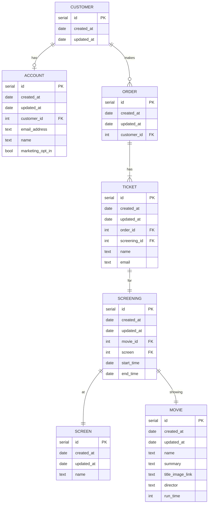

# ERD

```mermaid
erDiagram
    CUSTOMER ||--o| ACCOUNT : has
    CUSTOMER ||--o{ ORDER : makes
    ORDER ||--|{ TICKET : has
    TICKET ||--|| SCREENING : for
    SCREENING ||--|| SCREEN : at
    SCREENING ||--|| MOVIE : showing

    CUSTOMER {
        serial id PK
        date created_at
        date updated_at
    }

    ACCOUNT {
        serial id PK
        date created_at
        date updated_at
        int customer_id FK
        text email_address
        text name
        bool marketing_opt_in
    }

    ORDER {
        serial id PK
        date created_at
        date updated_at
        int customer_id FK
    }

    TICKET {
        serial id PK
        date created_at
        date updated_at
        int order_id FK
        int screening_id FK
        text name
        text email
    }

    SCREENING {
        serial id PK
        date created_at
        date updated_at
        int movie_id FK
        int screen FK
        date start_time
        date end_time
    }

    SCREEN {
        serial id PK
        date created_at
        date updated_at
        text name
    }

    MOVIE {
        serial id PK
        date created_at
        date updated_at
        text name
        text summary
        text title_image_link
        text director
        int run_time
    }
```
