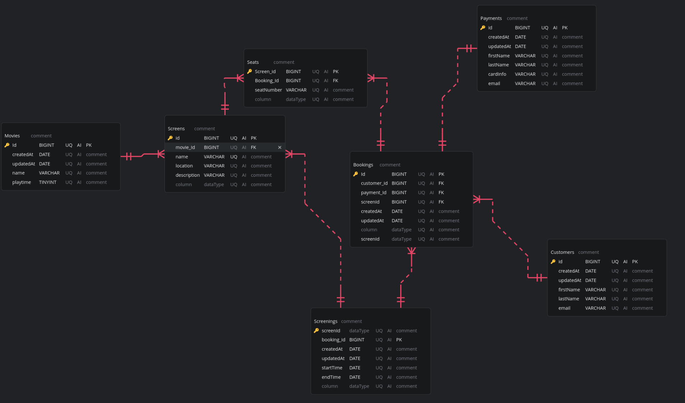

# Entity Relationship Diagrams
This document contains diagrams of a cinema booking system.

## Epic

A local cinema wants to allow people to book tickets online to see movies that are being shown in its various screens. These tickets should be delivered to customers via email. The cinema wants to keep a record of their customers and the tickets they purchase, as well as offer a regularly updated list of movies for them to choose from. A single screen might show multiple movies a day, and even the same movie at multiple times. The cinema will expand its number of screens in the future, so the potential for growth needs to be accounted for.


### User Stories
- As a customer, so I can receive my tickets, I want to provide my contact information.
- As a customer, so I can decide which movie I want to watch, I want to see a list of movies.
- As an admin, so I can manage the movies shown at the cinema, I want to update the list of movies.
- As a customer, so I can reserve my preferred seats, I want to be able to select a seat.


# Models

### Simple model

```
Customers
    id - PK
    createdAt Date
    updatedAt Date
    firstName VARCHAR
    lastName VARCHAR
    email VARCHAR
```
```
Screenings
    id - PK
    createdAt Date
    updatedAt Date
    avalible_Tickets TinyInt

    movieId - FK
    ticketId - FK
```
```
Tickets
    id - PK
    createdAt Date
    updatedAt Date

    ScreeningId - FK
```
```
Movies
    id - PK
    createdAt Date
    updatedAt Date
```
```
Bookings
    id - PK
    createdAt Date
    updatedAt Date

    customerId - FK
    paymentId - FK
    ticketId - FK

```
```
Payments
    id - PK
    createdAt Date
    updatedAt Date
    firstName VARCHAR
    lastName VARCHAR
    cardInfo VARCHAR
    email VARCHAR
```

### Model
NOTE - The models uses Crow´s Foot Notation for relation cardinalities.

### Original Version


### Revised version





### C#
NOTE - This code is autogenerated by my ERD Editor and may not reflect changes correctly.

```C#

public class Bookings {
  // PK
  public long Id { get; set; }
  // FK
  public long CustomerId { get; set; }
  // FK
  public long PaymentId { get; set; }
  // FK
  public long ScreenId { get; set; }
  public DateTime CreatedAt { get; set; }
  public DateTime UpdatedAt { get; set; }
  public string  { get; set; }
  public string ScreenId { get; set; }
}

public class Customers {
  // PK
  public long Id { get; set; }
  public DateTime CreatedAt { get; set; }
  public DateTime UpdatedAt { get; set; }
  public string FirstName { get; set; }
  public string LastName { get; set; }
  public string Email { get; set; }
}

public class Movies {
  // PK
  public long Id { get; set; }
  public DateTime CreatedAt { get; set; }
  public DateTime UpdatedAt { get; set; }
  public string Name { get; set; }
  public int Playtime { get; set; }
}

public class Payments {
  // PK
  public long Id { get; set; }
  public DateTime CreatedAt { get; set; }
  public DateTime UpdatedAt { get; set; }
  public string FirstName { get; set; }
  public string LastName { get; set; }
  public string CardInfo { get; set; }
  public string Email { get; set; }
}

public class Screenings {
  public string ScreenId { get; set; }
  // PK
  public long BookingId { get; set; }
  public DateTime CreatedAt { get; set; }
  public DateTime UpdatedAt { get; set; }
  public DateTime StartTime { get; set; }
  public DateTime EndTime { get; set; }
  public string  { get; set; }
}

public class Screens {
  // PK
  public long Id { get; set; }
  // FK
  public long MovieId { get; set; }
  public string Name { get; set; }
  public string Location { get; set; }
  public string Description { get; set; }
  public string  { get; set; }
}

public class Seats {
  // PK
  public long ScreenId { get; set; }
  // FK
  public long BookingId { get; set; }
  public string SeatNumber { get; set; }
  public string  { get; set; }
}

```