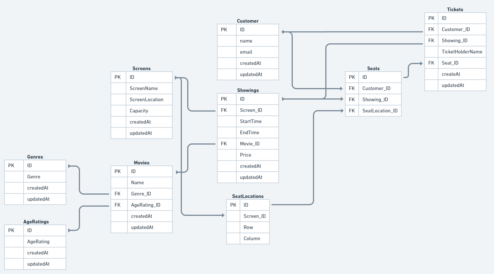

# Database Design

## User Stories

- As a customer, so I can receive my tickets, I want to provide my contact information.
- As a customer, so I can decide which movie I want to watch, I want to see a list of movies.
- As a customer, so I can decide when to got to the cinema, I want to see when a movie is playing.

- As a customer, so I can choose where to sit, I want to see avaiable seats and book them.

- As a customer, so I knew where to sit, I want to be able to see where a seat is.

- As a customer, so I can know how much it's going to cost, I want to see a the price of screenings.

- As a customer, so I can see my purchase history, I want to see my previous tickets.
- As an admin, so I can manage the movies shown at the cinema, I want to update the list of movies.
- As an admin, so I can manage when which movie shows, I want to update a list of showings.

- As an admin, so I can add more screens in the future, I want to be able to add more screens.

## Screenshot

